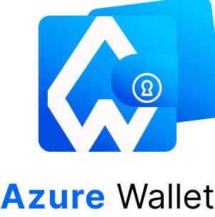

<p align="center">
  
</p>

# Azure Wallet

Carteira digital em Rust com Axum, Askama, SQLx e PostgreSQL dockerizado.

## Setup

1. Suba o banco:

```powershell
docker compose up -d
```

2. Crie o arquivo `.env` a partir de `.env.example`.

`AUTH_COOKIE_KEY` deve ter pelo menos 64 bytes. Em desenvolvimento local, mantenha `COOKIE_SECURE=false` para permitir cookie em HTTP.

3. Rode as migrations:

```powershell
sqlx migrate run
```

4. Execute a aplicacao:

```powershell
cargo run
```

A aplicacao sobe em `http://localhost:3000`.

## Autenticacao

- Cadastro e login sao fluxos separados.
- Senhas sao hasheadas com `bcrypt` usando `non_truncating_hash` e `DEFAULT_COST`.
- Login usa `non_truncating_verify`.
- O token de sessao fica no cookie `auth_token`, com `HttpOnly`, `SameSite=Lax` e criptografia via `PrivateCookieJar`.
- Segredos ficam em variaveis de ambiente, nao no codigo.

## Carteira

Cada ativo pertence a um usuario autenticado e possui:

- `name`
- `ticker`
- `asset_class`
- `quantity`
- `average_price`
- `current_price`
- `currency`

Valores financeiros usam `rust_decimal::Decimal`. O total da carteira e calculado por `quantity * current_price`.

## Testes

Com o banco disponivel:

```powershell
cargo test
```

Os testes cobrem autenticacao, validacoes, CRUD de ativos e calculo de total.
